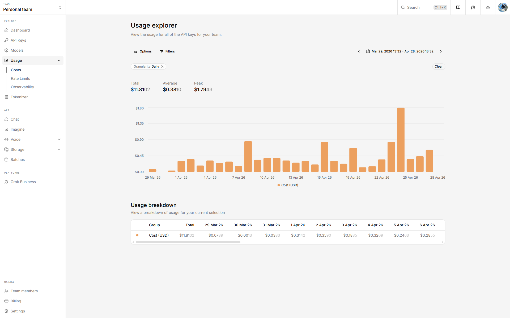

# AI Trend System

生成AIトレンド情報の自動収集パイプライン。RSS/Sitemap/Web検索で公式情報を取得し、Claude CodeとxAI Grok APIでレポートを生成して [trend-reports](https://github.com/miyaryo1212/trend-reports) に自動公開します。

## アーキテクチャ

```
systemd timer → run.sh <channel-id>
  │
  ├─ Step 0:   公式情報を取得 (RSS / Sitemap / JSON API / Web検索)
  ├─ Step 1:   新機能・トピック名を抽出 (claude -p)
  ├─ Step 2:   機能ごとにX上の反応を検索 (xAI Grok API x_search)
  ├─ Step 3:   最終Markdownレポートを生成 (claude -p)
  ├─ Step 3.5: Codex によるセカンドオピニオン注入 (codex exec, 任意)
  ├─ Step 3.6: frontmatter YAML 静的解析 (失敗時 claude -p で修正)
  └─ Step 4:   git push → Cloudflare Pages 自動ビルド・デプロイ
```

各レポートは **公式アップデート（ファクト）** + **コミュニティの反応（オピニオン）** の2層構造（CH5は学術論文サマリー特化）。

## チャンネル

| ID | テーマ | スケジュール |
|---|---|---|
| `claude-anthropic` | Claude / Anthropic | 毎日 6:00 |
| `codex-openai` | Codex / OpenAI | 毎日 6:30 |
| `ai-trends` | 生成AIトレンド総合 | 毎日 7:00 |
| `academia` | LLM/NLP最新論文 | 毎日 7:30 |
| `github-trending` | GitHub急成長リポ | 毎週月曜 8:00 |

## ディレクトリ構成

```
scripts/
  run.sh                          # メイン実行スクリプト (2段階パイプライン)
  setup-systemd.sh                # systemdユニットインストーラ
prompts/
  feature-extraction.md           # Step 1: 機能名抽出プロンプト
  trend-research.md               # Step 3: 最終レポート生成プロンプト (デフォルト)
  trend-research-academia.md      # Step 3: 学術論文向けテンプレート (CH5)
config/
  keywords.yml                    # チャネル・ソース・プロンプト定義
systemd/                          # timer/service定義
docs/                             # 設計ドキュメント / 画像
```

## 必要環境

- Ubuntu Server (systemd)
- Claude Max Plan (OAuth認証済み) — 本システムは **Max 5x Plan** で運用
- xAI API Key (Grok `x_search` 用)
- git, curl, jq, yq

## 運用コスト (2026-04-28 現在)

実際の運用コスト。

### 使用モデル

| ステップ | モデル | プラン / 単価 |
|---|---|---|
| Step 1 / 3 / 3.6 | Claude Code (`claude -p`) — Opus 4.7 (1M context, XHigh effort) | **Claude Max 5x Plan** (定額) |
| Step 2 | xAI Grok `grok-4-1-fast` + `x_search` ツール | 従量課金 (~$0.02/機能、新機能ゼロの日は$0) |
| Step 3.5 | Codex (`codex exec`) によるセカンドオピニオン | サブスク枠内 (定額) |
| ホスティング | Cloudflare Pages | Free tier |

> CH5 (academia) は `x_search.enabled: false` のためxAI課金は発生しません。

### xAI 実績 (過去30日)



- **Total: $11.81 / 30日**
- 平均: **$0.38/日**
- Peak: **$1.79/日** (新機能リリースが集中した日)

Claude Maxは定額のためxAI分のみ変動します。1日あたりの抽出機能数とほぼ比例。

## セットアップ

```bash
# 1. .env.local を作成
cp .env.local.example .env.local
# TREND_SYSTEM_DIR, TREND_REPORTS_DIR, XAI_API_KEY を設定

# 2. systemd timerをインストール
bash scripts/setup-systemd.sh

# 3. 手動実行テスト
bash scripts/run.sh claude-anthropic
```

## 関連リポジトリ

- [trend-reports](https://github.com/miyaryo1212/trend-reports) - Astro静的サイト（レポート公開）
